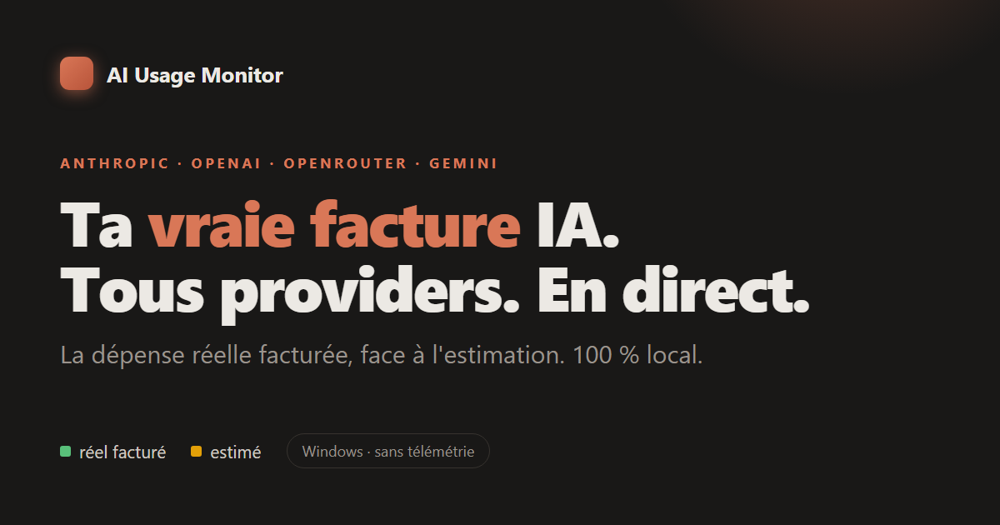
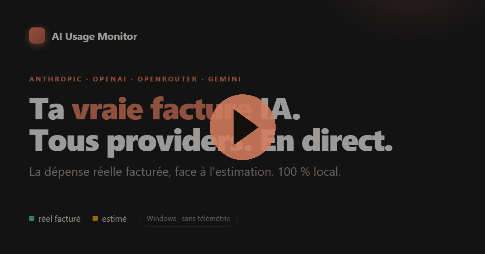

  

<h1 align="center">AI Usage Monitor</h1>

  Track your <b>real AI spend</b> across providers — billed cost vs estimate, in a 100% local Windows widget.

  
  
  
  
  

  <b><a href="https://github.com/MAG-Cie/ai-usage-monitor/releases/latest">⬇ Download for Windows</a></b> ·
  <a href="https://mag-cie.github.io/ai-usage-monitor/">Website</a> ·
  <a href="https://mag-cie.github.io/ai-usage-monitor/en/">English site</a>

  

<em>▶ 24-second overview — click to play</em>

---

## Why

Counting tokens locally gives you a **ballpark** — never the exact amount. Prompt-cache writes/reads are priced differently, batch and volume tiers apply discounts, prices shift. Over a busy month the gap between what you *think* you spend and your **actual bill** climbs to double digits.

AI Usage Monitor reads your **billed spend** from each provider's official API and shows it right next to the local estimate. Real and estimated are **never** mixed into one headline number.

## Providers

| Provider | Sources | Cost basis | Status |
|----------|---------|------------|--------|
| **Anthropic** | API Console (Admin API) · Claude Code local | real + estimated | ✅ verified |
| **OpenAI** | Organization costs & usage | real | 🧪 beta |
| **OpenRouter** | Activity & credits | real | 🧪 beta |
| **Gemini** | Cloud Monitoring · BigQuery billing | estimated + real | 🧪 beta |

> Beta = the adapter is written against provider docs and still being validated against live accounts. If a response shape differs, the provider shows **unavailable** rather than a wrong number.

All data goes through **official APIs** — no scraping, no telemetry.

## Features

- **Real vs estimated** — billed spend and local estimate side by side, with the gap in $ and %.
- **Always-on-top widget** + detailed dashboard (overview, history, sessions).
- **Budget alerts** — get notified when real spend hits a monthly / daily / per-provider threshold. *(Pro)*
- **Spend history & projection** — day-by-day, end-of-month projection, peak day. *(Pro: unlimited)*
- **CSV export** of your spend history. *(Pro)*
- **First-run wizard** — connect a provider and test the key in under a minute.
- **FR · EN · DE · ES** interface, automatic system-language detection.

## Free vs Pro

| | Free | Pro — €14.99 (2 seats, lifetime) |
|---|:---:|:---:|
| Providers tracked | 1 | **Unlimited** |
| Widget + dashboard | ✅ | ✅ |
| Real vs estimated | ✅ | ✅ |
| Spend history | 7 days | **Unlimited** |
| Budget alerts | — | ✅ |
| CSV export | — | ✅ |
| Updates | ✅ | ✅ |

[**Get Pro →**](https://magcie.lemonsqueezy.com/checkout/buy/094a9c50-e5b5-4889-94c3-867349fbf61a) · sold via Lemon Squeezy · 14-day refund.

## Install

1. [Download the latest release](https://github.com/MAG-Cie/ai-usage-monitor/releases/latest) (`AI-Usage-Monitor-Setup-x.y.z.exe`).
2. Run it. Auto-updates are enabled for future versions.

> ⚠️ Early builds are **not yet code-signed** with an OV certificate, so Windows SmartScreen may warn ("unknown publisher"). Click *More info → Run anyway*. The installer is scanned clean on [VirusTotal (**0 detections**)](https://www.virustotal.com/gui/file/211940d1a365744413a5d4d427f3b72f94df68ee7dd08477f4fdba38e0e2add4/detection). Code signing will come once the product is established.

**Launch at startup:** Settings → Preferences → check *Launch at Windows startup*.

## Privacy & security

No telemetry, no analytics, no backend of ours. Your API keys are encrypted by the OS keychain (Windows DPAPI) and never leave your machine in clear text.

- [docs/NETWORK.md](docs/NETWORK.md) — the exhaustive list of network destinations.
- [SECURITY.md](SECURITY.md) — security policy & how to report an issue.

Three network destinations only: the provider APIs you configure, GitHub (updates), Lemon Squeezy (license).

## Links

- 🌐 Website: https://mag-cie.github.io/ai-usage-monitor/
- 📄 [Legal notice](https://mag-cie.github.io/ai-usage-monitor/mentions-legales/) · [Privacy](https://mag-cie.github.io/ai-usage-monitor/confidentialite/)
- 📝 [Changelog](CHANGELOG.md)
- 💬 [Discussions](https://github.com/MAG-Cie/ai-usage-monitor/discussions) — questions & ideas.

## License

Proprietary — © 2026 MAG&Cie. All rights reserved. Not open source. See [LICENSE](LICENSE).
